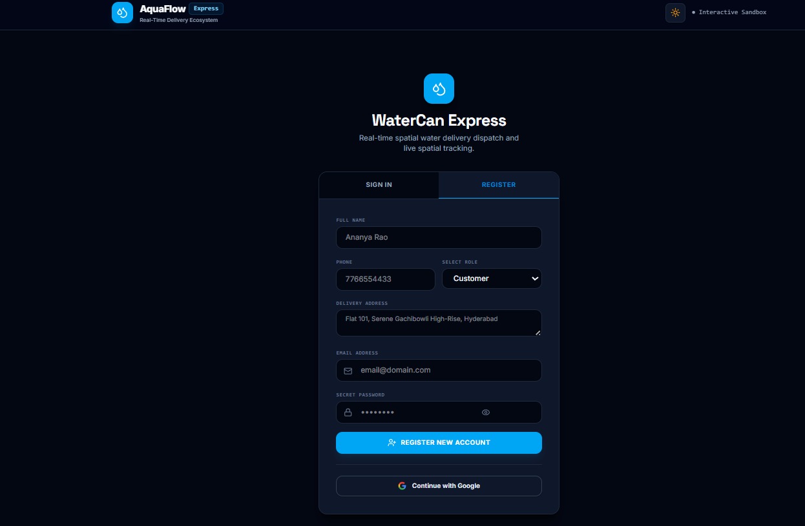
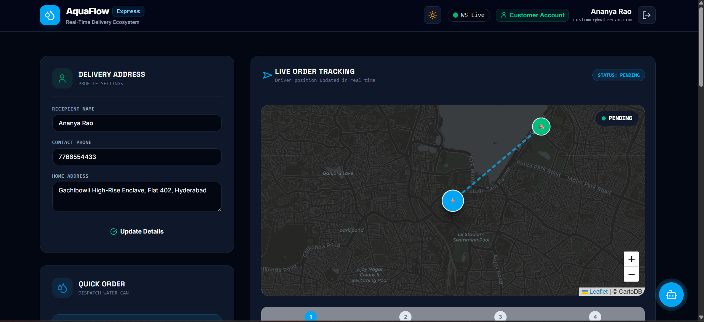
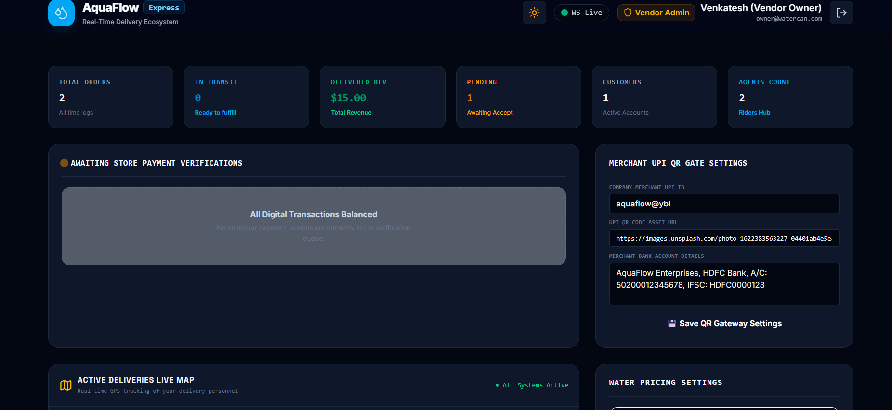
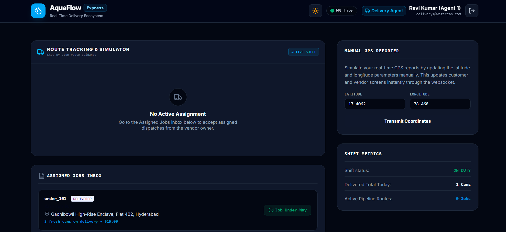

# 🚰 AquaFlow

AquaFlow is a modern subscription-based water delivery platform that connects customers, vendors, and delivery agents through real-time tracking, notifications, and delivery management.

## Features

- 🔐 JWT Authentication
- 📍 Real-Time Delivery Tracking
- 🔔 Instant Notifications
- 👥 Role-Based Dashboards
- 💳 QR Code Payment Verification
- 📅 Scheduled Deliveries
- 📦 Subscription Management
- 🚚 Delivery Agent Management
## Tech Stack

- React
- TypeScript
- Vite
- Express.js
- Socket.IO
- JWT
- Node.js

## Future Enhancements

- Google Authentication
- WhatsApp Notifications
- SMS Notifications
- GPS Live Tracking
- PostgreSQL Database
- Mobile App
## 📸 Screenshots

### 🔐 Login Page

---

### 👤 Customer Dashboard

---

### 🏢 Owner Dashboard

---

### 🚚 Delivery_Agent Dashboard

